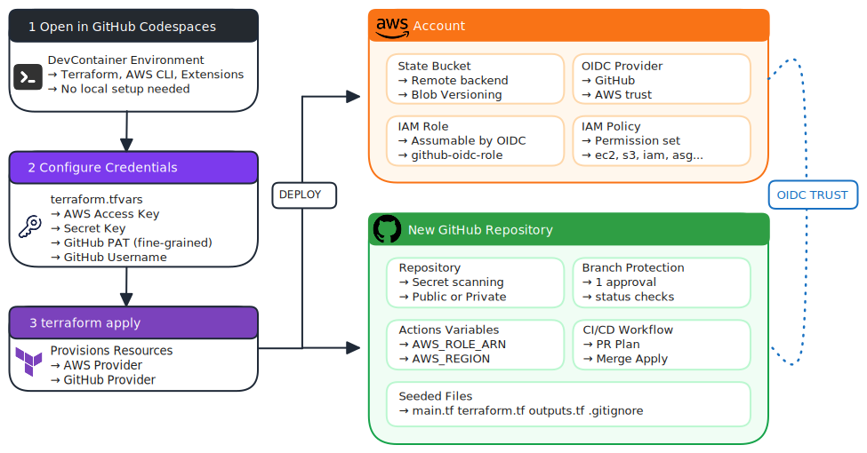

# accelerator-terraform-aws-oidc-gha

A bootstrap tool that provisions everything you need to run automated Terraform deployments on AWS using OIDC authentication from GitHub Actions — no long-lived AWS credentials stored in your CI/CD pipeline.

You run this repo once locally. It creates an S3 backend, an OIDC trust between AWS and GitHub, and a fully configured GitHub repository with a ready-to-go Terraform CI/CD workflow. After that, all infrastructure changes are made through pull requests and merges in the new repo.

---

## Table of Contents

- [How It Works](#how-it-works)
- [Prerequisites](#prerequisites)
  - [1. AWS Access Key and Secret Key](#1-aws-access-key-and-secret-key)
  - [2. GitHub Personal Access Token (PAT)](#2-github-personal-access-token-pat)
  - [3. Terraform CLI](#3-terraform-cli)
- [Getting Started](#getting-started)
- [What Gets Deployed](#what-gets-deployed)
  - [AWS Resources](#aws-resources)
  - [GitHub Resources](#github-resources)
  - [Repository Files](#repository-files)
- [Customization](#customization)
- [Tearing Down](#tearing-down)

---

## How It Works

<p align="center">
  
</p>

---

## Prerequisites

### 1. AWS Access Key and Secret Key

You need an access key with sufficient permissions to provision the bootstrap resources. These credentials are **only used once** during the bootstrap and are **not** stored anywhere after.

If you're new to AWS, you'll sign in as the **root user** (the email and password you used when creating your AWS account). You can create an access key directly on the root user, which is the quickest way to get started. However, AWS recommends creating a dedicated **IAM user** instead — root access keys carry full account permissions with no way to scope them down.

**Option A: Create an access key on the root user (quickest)**

1. Sign in to the [AWS Management Console](https://console.aws.amazon.com/) with your root account email.
2. Click your account name (top-right) > **Security credentials**.
3. Under **Access keys**, click **Create access key**.
4. Acknowledge the warning and create the key.
5. Copy and save the **Access Key ID** and **Secret Access Key**.

**Option B: Create an IAM user (recommended)**

1. Sign in to the [AWS Management Console](https://console.aws.amazon.com/).
2. Navigate to **IAM** > **Users** > **Create user**.
3. Attach the **AdministratorAccess** policy (or a scoped policy — see below).
4. Go to the new user's **Security credentials** tab.
5. Under **Access keys**, click **Create access key**.
6. Select **Command Line Interface (CLI)** as the use case.
7. Copy and save the **Access Key ID** and **Secret Access Key**.

The user needs sufficient permissions to create:
- S3 buckets
- IAM roles, policies, and OIDC providers
- Any permissions listed in the `policy_actions` block (by default: `ec2:*`, `iam:*`, `s3:*`, `autoscaling:*`, `cloudwatch:*`, `logs:*`, `sts:GetCallerIdentity`)

> For simplicity during bootstrap, `AdministratorAccess` works. You can scope it down afterwards.

**References:**
- [AWS docs — Managing access keys](https://docs.aws.amazon.com/IAM/latest/UserGuide/id_credentials_access-keys.html)
- [AWS docs — Creating your first IAM user](https://docs.aws.amazon.com/IAM/latest/UserGuide/id_users_create.html)

---

### 2. GitHub Personal Access Token (PAT)

You need a **fine-grained** Personal Access Token with the following **repository permissions**:

| Permission | Access | Why |
|---|---|---|
| **Actions** | Read and write | Manage workflow runs and artifacts |
| **Administration** | Read and write | Create repositories, manage settings and collaborators |
| **Contents** | Read and write | Push commits, manage branches and files |
| **Metadata** | Read-only *(required)* | Access repository metadata |
| **Variables** | Read and write | Set Actions repository variables (AWS_REGION, AWS_ROLE_ARN, etc.) |
| **Workflows** | Read and write | Create and update GitHub Actions workflow files |

**Steps to create a fine-grained PAT:**

1. Go to [GitHub Settings > Developer settings > Fine-grained tokens](https://github.com/settings/tokens?type=beta).
2. Click **Generate new token**.
3. Give it a descriptive name (e.g. `seed-terraform-bootstrap`).
4. Set an appropriate expiration.
5. Under **Repository access**, select **All repositories** (or scope to your account/org).
6. Under **Permissions > Repository permissions**, enable the permissions listed above.
7. Click **Generate token** and copy it immediately.

**Reference:** [GitHub docs — Creating a fine-grained PAT](https://docs.github.com/en/authentication/keeping-your-account-and-data-secure/managing-your-personal-access-tokens#creating-a-fine-grained-personal-access-token)

---

### 3. Terraform CLI (local only)

> If you're using **GitHub Codespaces**, Terraform is already installed via the devcontainer — skip this step.

Install Terraform **>= 1.6.0**.

- [Download Terraform](https://developer.hashicorp.com/terraform/install)

Verify installation:
```bash
terraform -version
```

---

## Getting Started

### Option A: Use GitHub Codespaces (recommended)

This repo includes a [devcontainer](.devcontainer/devcontainer.json) that comes pre-installed with Terraform, the AWS CLI, and the HashiCorp Terraform VS Code extension. Using Codespaces means you can skip installing Terraform locally and don't need to clone anything.

1. Open this repository on GitHub.
2. Click **Code** > **Codespaces** > **Create codespace on main**.
3. Wait for the environment to build — Terraform will be ready to use immediately.
4. Skip to step 2 below.

> [What are GitHub Codespaces?](https://docs.github.com/en/codespaces/overview)

### Option B: Run locally

1. **Clone this repository**

   ```bash
   git clone https://github.com/luke-taylor/accelerator-terraform-aws-oidc-gha
   cd seed-terraform-aws
   ```

2. **Create your `terraform.tfvars` file**

   Copy the disabled template and fill in your values:

   ```bash
   cp terraform.tfvars.disabled terraform.tfvars
   ```

   Edit `terraform.tfvars`:

   ```hcl
   github_owner   = "<Your GitHub Username>"
   github_token   = "<Your GitHub PAT>"
   aws_access_key = "<Your AWS Access Key>"
   aws_secret_key = "<Your AWS Secret Key>"
   ```

   > `terraform.tfvars` is git-ignored and will not be committed.

3. **Initialize and apply**

   ```bash
   terraform init
   terraform plan
   terraform apply
   ```

4. **Done.** Terraform will output the URL of your new GitHub repository. Open it and start building infrastructure through pull requests.

---

## What Gets Deployed

### AWS Resources

| Resource | Purpose |
|---|---|
| **S3 Bucket** (versioned) | Stores Terraform remote state for the new repository. Bucket name is randomized with a hex suffix to ensure uniqueness. |
| **IAM OIDC Provider** | Establishes a trust relationship between GitHub Actions and your AWS account using `token.actions.githubusercontent.com`. |
| **IAM Role** | An assumable role (`github-oidc-role`) that GitHub Actions uses via OIDC. Scoped to your specific repository. |
| **IAM Policy** | Attached to the OIDC role. Controls what AWS actions the CI/CD pipeline can perform (EC2, S3, IAM, etc.). |

### GitHub Resources

| Resource | Purpose |
|---|---|
| **Repository** | A new GitHub repo with issues enabled, secret scanning on, and branch protections configured. |
| **Branch protection** | Requires 1 approving review, dismisses stale reviews, enforces the `Terraform` status check on `main`. |
| **Actions variables** | `AWS_REGION`, `AWS_ROLE_ARN`, and `TF_STATE_BUCKET` — used by the workflow to authenticate and manage state. |

### Repository Files

The new repository is seeded with the following files:

```
.github/workflows/terraform.yml   # CI/CD workflow (plan/apply/destroy)
.gitignore                         # Terraform-specific ignores
README.md                          # Auto-generated repo documentation
terraform/main.tf                  # Starter resource file (example S3 bucket)
terraform/terraform.tf             # Provider config + S3 backend
terraform/outputs.tf               # Starter outputs
```

**The CI/CD workflow supports three trigger modes:**

| Trigger | Behavior |
|---|---|
| Pull Request | Runs `terraform plan` and posts the output as a PR comment |
| Push to `main` | Runs `terraform plan` then `terraform apply` |
| Manual (`workflow_dispatch`) | Choose between `plan`, `apply`, or `destroy` |

---

## Customization

All customization is done in the root [main.tf](main.tf) before running `terraform apply`.

### Change the repository name

Set the `repository_name` variable in `terraform.tfvars` or `variables.tf`:

```hcl
variable "repository_name" {
  default = "my-infra-repo"
}
```

### Change the AWS region

Update the `aws_region` value in the `module "github"` block and the `provider "aws"` block:

```hcl
provider "aws" {
  region = "us-east-1"
}

module "github" {
  # ...
  aws_region = "us-east-1"
}
```

### Modify IAM permissions

Adjust the `policy_actions` list in the `module "aws"` block to control what the OIDC role can do:

```hcl
module "aws" {
  # ...
  iam = {
    role_name   = "github-oidc-role"
    policy_name = "GitHubOIDCPolicy"
    policy_actions = [
      "s3:*",
      "dynamodb:*",
      "lambda:*",
      "sts:GetCallerIdentity"
    ]
  }
}
```

### Restrict OIDC subject claims

By default, the OIDC trust uses `repo:<owner>/<repo>:*`, which allows any branch or event. You can restrict it:

```hcl
allowed_subjects = [
  "repo:my-org/my-repo:ref:refs/heads/main"
]
```

This ensures only workflows triggered from the `main` branch can assume the role.

### Change S3 state bucket settings

```hcl
module "aws" {
  # ...
  s3 = {
    bucket_name   = "my-custom-state-bucket-${random_bytes.this.hex}"
    force_destroy = false  # Prevent accidental deletion of state
  }
}
```

---

## Tearing Down

To remove everything this bootstrap created:

```bash
terraform destroy
```

This will delete the AWS resources (S3 bucket, IAM role, OIDC provider) and the GitHub repository. If `force_destroy` is set to `true` on the S3 bucket (the default), the bucket will be deleted even if it contains state files.

---

## Providers

| Provider | Version | Purpose |
|---|---|---|
| [hashicorp/aws](https://registry.terraform.io/providers/hashicorp/aws/latest) | 6.31.0 | AWS resource management |
| [integrations/github](https://registry.terraform.io/providers/integrations/github/latest) | 6.11.0 | GitHub repository and settings management |
| [hashicorp/random](https://registry.terraform.io/providers/hashicorp/random/latest) | 3.8.1 | Random suffix for globally unique S3 bucket names |
| [hashicorp/tls](https://registry.terraform.io/providers/hashicorp/tls/latest) | 4.2.1 | Fetching the GitHub OIDC thumbprint |
